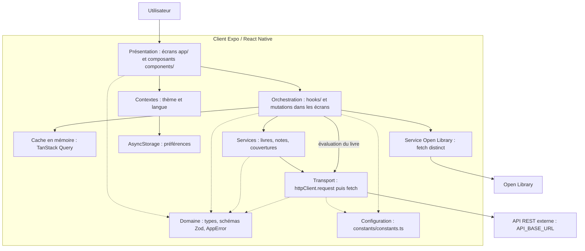
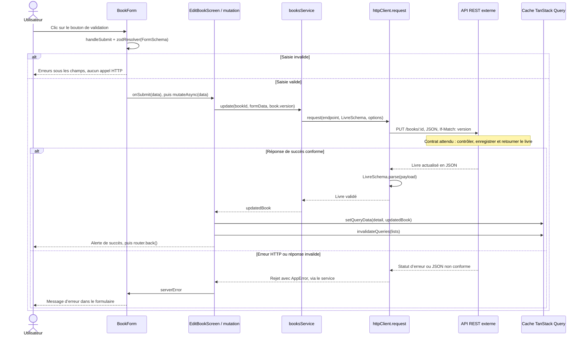

# Architecture — BookListPro

Ce document décrit le client présent dans ce dépôt et suit la modification d’un livre, depuis le clic sur « Modifier » jusqu’à l’API REST, puis au rafraîchissement de l’interface. Le serveur est un projet distinct : ses contrôleurs, sa logique de persistance et sa base de données ne sont pas disponibles ici.

La pile déclarée utilise React Native, TypeScript, Expo SDK 54, Expo Router et TanStack Query. Référence Expo consultée : [documentation versionnée SDK 54](https://docs.expo.dev/versions/v54.0.0/). Les motivations des choix sont décrites dans [ADR.md](ADR.md).

## Schéma des couches

Les flèches pleines représentent les appels ; les flèches pointillées représentent des dépendances partagées.



| Couche | Responsabilité | Fichiers principaux |
| --- | --- | --- |
| Composition et navigation | Installer les providers et déclarer la pile des écrans | [app/_layout.tsx](../app/_layout.tsx) |
| Présentation | Afficher les données, recueillir la saisie, déclencher les actions et afficher les erreurs | [bibliothèque](../app/index.tsx), [fiche](../app/books/[id].tsx), [édition](../app/books/edit/[id].tsx), [BookForm](../components/BookForm.tsx) |
| Orchestration | Gérer les requêtes, mutations, chargements et mises à jour du cache | [useBooks](../hooks/useBooks.ts), [useBookDetail](../hooks/useBookDetail.ts), [useOptimisticBookToggles](../hooks/useOptimisticBookToggles.ts), mutations dans les écrans |
| Services | Choisir l’endpoint, la méthode, le corps JSON et le schéma de réponse | [booksService](../app/services/api/booksService.ts), [notesService](../app/services/api/notesService.ts), [coverUploadService](../app/services/coverUploadService.ts) |
| Transport | Construire l’URL et les en-têtes, appeler `fetch`, traiter les statuts HTTP et valider la réponse | [httpClient](../app/services/api/httpClient.ts) |
| Domaine partagé | Définir les contrats de données et les catégories d’erreurs | [livre.ts](../app/domain/livre.ts), [note.ts](../app/domain/note.ts), [errors.ts](../app/domain/errors.ts) |
| Configuration et préférences | Centraliser URL, délais et clés de cache ; conserver thème et langue | [constants.ts](../constants/constants.ts), [ThemeContext](../app/theme/ThemeContext.tsx), [i18n](../app/i18n/i18n.tsx) |

Cette séparation n’est pas stricte : l’écran d’édition déclare lui-même `useQuery` et `useMutation`, sans hook `useUpdateBook`. Le hook [useBookRating](../hooks/useBookRating.ts) appelle directement `request`. Open Library utilise son propre transport et un résultat de repli, indépendamment de l’API principale.

## État et cache

La racine crée un `QueryClient`, puis installe `QueryClientProvider`, `ThemeProvider` et `I18nProvider` autour de la navigation.

| Donnée | Emplacement | Durée de vie |
| --- | --- | --- |
| Livres et notes reçus du serveur | Cache TanStack Query | En mémoire, sans persistance sur disque |
| Champs du formulaire | React Hook Form dans `BookForm` | Pendant la vie du formulaire |
| Message d’erreur d’édition | État React `serverError` | Pendant la vie de l’écran |
| Thème et langue | Contextes React et AsyncStorage | Conservés entre les lancements |

Les clés sont centralisées : `['books', 'list', filters]` distingue les listes par filtres et pagination ; `['books', 'detail', id]` identifie une fiche ; `['notes', 'book', livreId]` identifie ses notes textuelles.

Les requêtes sont considérées comme fraîches pendant 30 secondes ; les caches inactifs sont conservés 5 minutes. La configuration des requêtes autorise deux nouvelles tentatives pour les erreurs autres que `VALIDATION`, `CONFLIT` et `AUTH`, avec délai exponentiel. Cette configuration concerne les lectures ; la mutation d’édition ne configure pas de nouvelle tentative automatique.

## Parcours complet : modifier un livre

### 1. Ouvrir et remplir le formulaire

1. Dans la fiche `app/books/[id].tsx`, le clic sur le bouton de modification exécute `router.push('/books/edit/' + book.id)`.
2. Expo Router affiche `EditBookScreen`, qui récupère l’identifiant avec `useLocalSearchParams`.
3. L’écran consulte `bookKeys.detail(bookId)` avec `useQuery`. Selon l’état du cache, les données sont réutilisées ou chargées par `booksService.getById`, puis `request`, via `GET /books/:id`.
4. Le livre reçu est validé avec `LivreSchema`, notamment son UUID, ses champs bibliographiques, ses dates et sa `version`. L’écran affiche un squelette pendant le chargement, ou `ErrorView` avec `refetch` si la lecture échoue.
5. `BookForm` reçoit les valeurs initiales de `titre`, `auteur`, `editeur`, `annee` et `lu`. Les changements des champs restent dans React Hook Form jusqu’à la soumission.

### 2. Du clic d’enregistrement au serveur



Le bouton appelle `handleSubmit(onSubmit)`. Le schéma réellement utilisé par `BookForm` est `FormSchema`, dérivé de `LivreSchema.pick(...)` sur les cinq champs éditables. `LivreFormSchema` existe aussi dans le domaine, mais n’est pas le resolver de ce composant. Le titre, l’auteur et l’éditeur doivent être non vides ; l’année doit être un entier entre 1450 et 2027 ; `lu` doit être un booléen.

Si la validation réussit, l’écran efface `serverError`, puis attend `updateMutation.mutateAsync(data)`. L’état `isPending` désactive les champs et le bouton et affiche un indicateur de chargement.

`booksService.update` sérialise les cinq champs avec `JSON.stringify`. `request` ajoute `Content-Type: application/json` et convertit la version en chaîne pour l’en-tête `If-Match`. L’URL est construite avec `API_BASE_URL`, actuellement `http://localhost:3000`. Un `AbortController` déclenche l’abandon de la requête après 8 secondes si `fetch` n’a pas encore répondu.

Exemple illustratif pour un livre chargé en version 3 :

```http
PUT /books/550e8400-e29b-41d4-a716-446655440000 HTTP/1.1
Host: localhost:3000
Content-Type: application/json
If-Match: 3

{
  "titre": "Le Rouge et le Noir",
  "auteur": "Stendhal",
  "editeur": "Gallimard",
  "annee": 1830,
  "lu": true
}
```

L’identifiant est dans l’URL et la version dans l’en-tête. Le corps ne contient ni `favori`, ni `note`, ni `couverture` : ces propriétés suivent des actions distinctes.

### 3. Frontière serveur

Le contrat attendu est que l’API valide les données, compare atomiquement `If-Match` à la version courante, enregistre la modification si elle est acceptée et retourne un livre complet actualisé, avec sa version et ses dates. En cas de version obsolète, le client attend HTTP **409**.

Ces opérations sont des responsabilités du serveur externe, pas des étapes vérifiables dans ce dépôt. Aucun choix de framework backend, de base de données ou de transaction ne peut être déduit du client. La validation Zod côté client ne remplace pas les contrôles serveur.

### 4. Retour vers l’interface

Sur une réponse HTTP réussie, `request` valide le JSON avec `LivreSchema`. Seul un livre conforme résout la promesse de la mutation.

Dans `onSuccess`, l’écran remplace immédiatement le cache de détail par `updatedBook`, puis invalide toutes les listes via `bookKeys.lists()`. Les listes actives peuvent être rechargées ; les autres sont marquées périmées pour une prochaine consultation. Cette invalidation permet de recalculer le tri, les filtres et la pagination après la modification.

Une alerte confirme le succès. Sur le web, `router.back()` suit la fermeture de `window.alert` ; sur mobile, il est déclenché par le bouton « OK » de l’alerte. L’édition du formulaire attend donc le succès serveur avant de remplacer le livre en cache.

### 5. Erreurs et conflits

| Situation | Traitement dans le client HTTP | Résultat dans l’écran d’édition |
| --- | --- | --- |
| HTTP 422 | `VALIDATION`, avec `champs` éventuel | Les détails par champ sont regroupés dans le bandeau `serverError` |
| HTTP 409 | `CONFLIT`, avec `versionAttendue` éventuelle | Message invitant à recharger la fiche |
| HTTP 401 ou 403 | `AUTH` | Affichage du message reçu |
| Autre erreur HTTP | `RESEAU` | Message serveur ou message de repli |
| Échec réseau ou expiration du délai | `RESEAU` | Message de connexion ou de timeout |
| JSON de succès incompatible avec Zod | Actuellement converti en `RESEAU` | Message générique de connexion |

En cas d’échec, `onSuccess` n’est pas exécuté : pas de navigation de succès ni de remplacement du cache par la saisie. Le formulaire reste affiché. Un échec réseau ou de validation de réponse ne prouve toutefois pas que le serveur n’a rien enregistré.

Le traitement du conflit ne réalise ni fusion, ni écrasement forcé, ni rechargement automatique avec conservation du brouillon. La version transmise est `book.version` au moment de la mutation ; le code ne conserve pas séparément une version figée à l’ouverture du formulaire.

## Variante : basculer lu/non lu ou favori

Les actions rapides utilisent [useOptimisticBookToggles](../hooks/useOptimisticBookToggles.ts), avec un affichage anticipé :

1. Le clic déclenche `toggleLu(id, lu)` ou `toggleFavori(id, favori)`.
2. `onMutate` demande l’annulation des requêtes `books`, sauvegarde les listes et le détail, puis modifie immédiatement leurs valeurs en cache.
3. Le service envoie `PATCH /books/:id`, avec uniquement `{ "lu": true }` ou `{ "favori": true }`, par le même client HTTP.
4. En cas d’erreur, `onError` restaure les snapshots précédents.
5. Dans tous les cas, `onSettled` invalide les listes et la fiche pour les resynchroniser avec le serveur.

Ces `PATCH`, ainsi que celui de l’évaluation `note`, n’envoient pas `If-Match`. La restauration du cache est un mécanisme local ; elle n’est pas un contrôle de concurrence côté serveur.

Dans le transport actuel, le signal fourni par TanStack Query est remplacé par celui du timeout interne. L’appel à `cancelQueries` ne garantit donc pas l’interruption du `fetch` déjà lancé. Cette description suit le code de `httpClient.ts`, même si d’autres documents indiquent que ce point a été corrigé.

## Repères de vérification

Les [tests du service livres](../tests/services/booksService.test.ts) vérifient notamment le `PUT`, l’en-tête `If-Match` et la remontée d’un conflit. Les [tests HTTP](../tests/services/httpClient.test.ts) couvrent le transport ; les [tests du domaine](../tests/domain/schemas.test.ts) vérifient les schémas ; les [tests de useBooks](../tests/hooks/useBooks.test.tsx) couvrent la lecture et les filtres.

Ces tests utilisent un réseau simulé : ils ne prouvent pas le parcours complet sur un serveur réel, ni l’atomicité de son contrôle de version. Le [README](../README.md#contrat-api) décrit les autres endpoints attendus.
